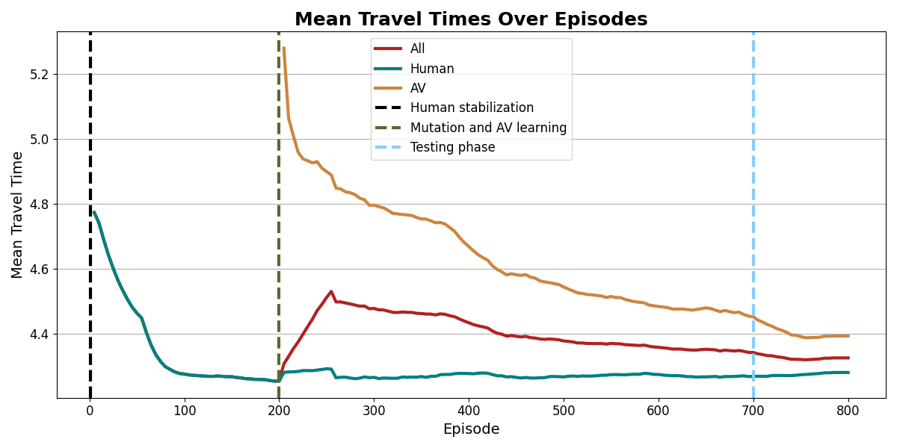
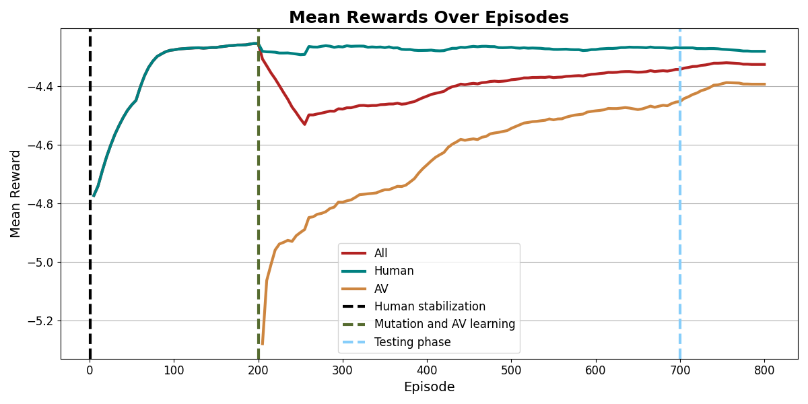
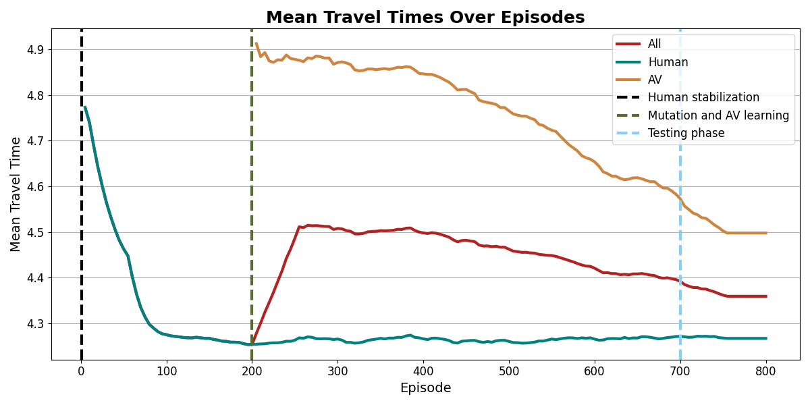
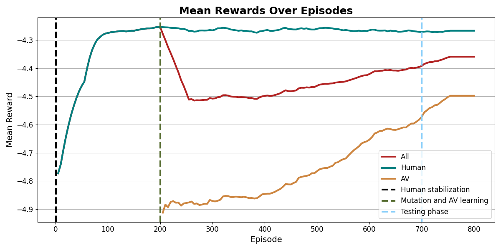

# Bandit REINFORCE Hyperparameter Sweep Report

## 1. Algorithm Overview

The core algorithm used in this experiment is **Bandit REINFORCE**, an independent policy gradient model utilizing a PyTorch Multi-Layer Perceptron (MLP). It replaces deterministic action-bound algorithms (like UCB) with a differentiable, stochastic deep learning approach to optimize multi-agent traffic routing.

### 1.1 Action Selection
The agent’s neural network outputs a vector of scores (logits) for each available route. These logits are scaled by a **Temperature ($\tau$)** parameter to control the sharpness of the distribution, and are then converted into probabilities using a Softmax function:

$$ \pi(a|s) = \frac{\exp(Z_a / \tau)}{\sum_{i} \exp(Z_i / \tau)} $$
*(Where $Z$ represents the logits output by the neural network for action $a$)*

### 1.2 Policy Update (REINFORCE)
Once the vehicle completes its route, it receives a reward $R$ (negative travel time). The algorithm uses a baseline $b$ to reduce variance. The weights of the neural network $\theta$ are updated using gradient ascent, scaled by the **Learning Rate ($\alpha$)**:

$$ \theta \leftarrow \theta + \alpha \nabla_\theta \log \pi(a|s) (R - b) $$

### 1.3 Exploration via Entropy
To prevent the agent from permanently committing to sub-optimal routes early in the training phase, an **Entropy Bonus** is added to the objective function, scaled by the **Entropy Coefficient ($\beta$)**:

$$ H(\pi) = - \sum_{a} \pi(a|s) \log \pi(a|s) $$
$$ \text{Objective} = \text{Expected Reward} + \beta H(\pi) $$

---

## 2. Experimental Setup

The hyperparameter sweep consisted of **54 total parallel jobs**, evaluating every combination of the following parameters across **3 random seeds**:

* **Learning Rate ($\alpha$):** `3e-4`, `1e-3`
* **Entropy Coefficient ($\beta$):** `0.01`, `0.05`, `0.10`
* **Temperature ($\tau$):** `0.5`, `1.0`, `2.0`
* **Random Seeds:** `42`, `123`, `7`

Each job executed 500 training episodes and 100 testing episodes on the `ingolstadt_custom` network map.

---

## 3. Prerequisite Check: The TraCI Handle Bug

### Context
Another prerequisite flagged in the documentation questioned whether `env.simulator.sumo` was the correct handle to access the active SUMO simulation. If incorrect, the connection would fail and the algorithm would fall back to feeding the neural network neutral constants `[1.0, 0.0]` instead of real-time traffic data.

### Investigation & Resolution
To verify this, the internal source code of the RouteRL simulator (`/home/sathyakumarnandakumar/URB/urbenv-github/lib/python3.12/site-packages/routerl/environment/simulator.py`) was analyzed. It was discovered that the true active handle was `env.simulator.sumo_connection`. The Bandit REINFORCE script was patched prior to the sweep to use this correct handle, ensuring the neural network received actual, real-time congestion data throughout the entire 54-job execution.

---

## 4. Results and Rankings

The results demonstrate the stability of the Bandit REINFORCE algorithm in this topology. The average travel time for Autonomous Vehicles (CAVs) across all configurations fell into a tightly clustered band between **4.328 seconds** and **4.403 seconds**.

### 🏆 Top 5 Configurations
Ranked by the lowest average CAV travel time across all 3 seeds.

| Rank | Learning Rate | Entropy | Temperature | Average CAV Travel Time (s) | Overall Test Travel Time (s) |
|------|---------------|---------|-------------|-----------------------------|------------------------------|
| **1**| **1e-3**      | **0.05**| **0.5**     | **4.328**                   | **4.282**                    |
| 2    | 1e-3          | 0.10    | 1.0         | 4.363                       | 4.294                        |
| 3    | 1e-3          | 0.10    | 0.5         | 4.365                       | 4.292                        |
| 4    | 3e-4          | 0.01    | 0.5         | 4.373                       | 4.293                        |
| 5    | 1e-3          | 0.01    | 1.0         | 4.374                       | 4.298                        |

### 📉 Bottom 5 Configurations

| Rank | Learning Rate | Entropy | Temperature | Average CAV Travel Time (s) | Overall Test Travel Time (s) |
|------|---------------|---------|-------------|-----------------------------|------------------------------|
| 50   | 3e-4          | 0.10    | 1.0         | 4.393                       | 4.306                        |
| 51   | 3e-4          | 0.01    | 2.0         | 4.395                       | 4.311                        |
| 52   | 1e-3          | 0.01    | 2.0         | 4.397                       | 4.313                        |
| 53   | 3e-4          | 0.05    | 0.5         | 4.401                       | 4.312                        |
| 54   | 3e-4          | 0.01    | 1.0         | 4.403                       | 4.309                        |

---

## 5. Visual Analysis

### The Best Configuration
**Parameters:** `lr=1e-3`, `entropy=0.05`, `temperature=0.5`
Notice the tight, highly stable convergence band during the testing phase.

**Travel Times:**

**Rewards:**

---

### The Worst Configuration
**Parameters:** `lr=3e-4`, `entropy=0.01`, `temperature=1.0`
While the convergence still succeeds, it is noticeably noisier with wider variance during both training and testing.

**Travel Times:**

**Rewards:**

